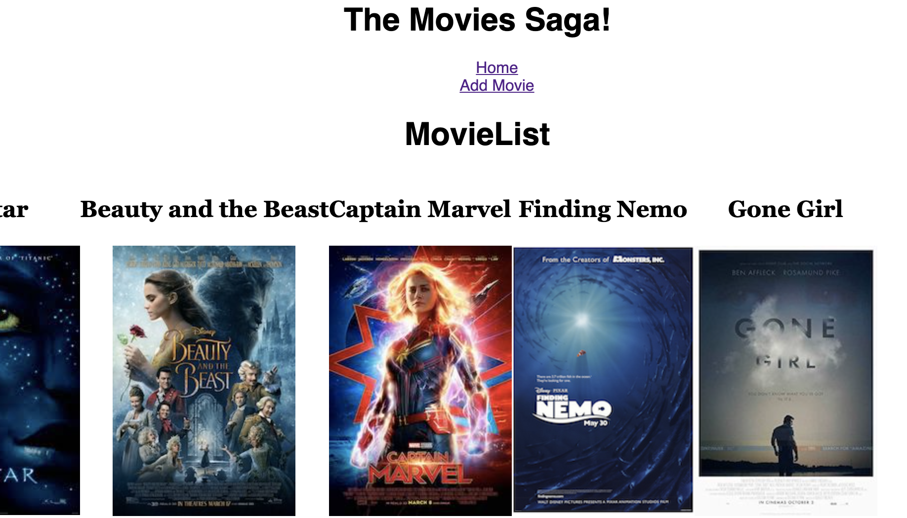
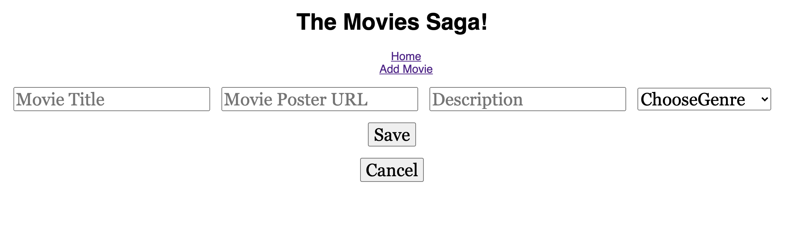
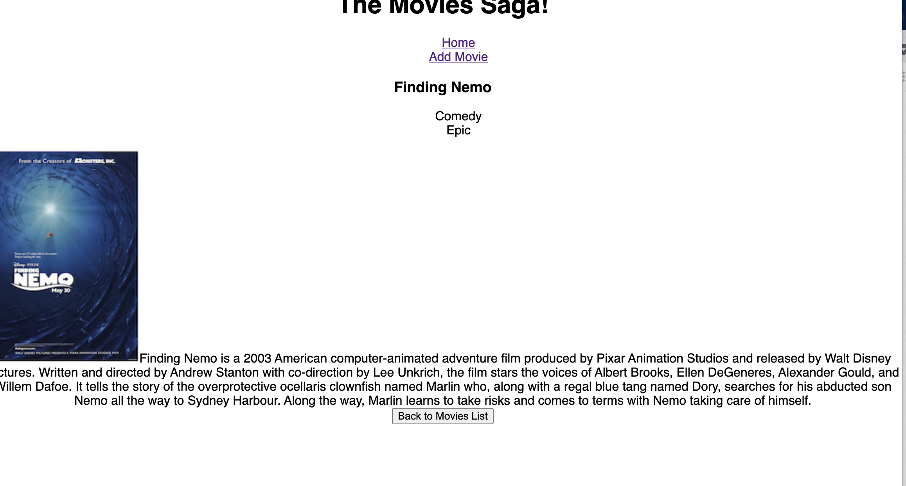
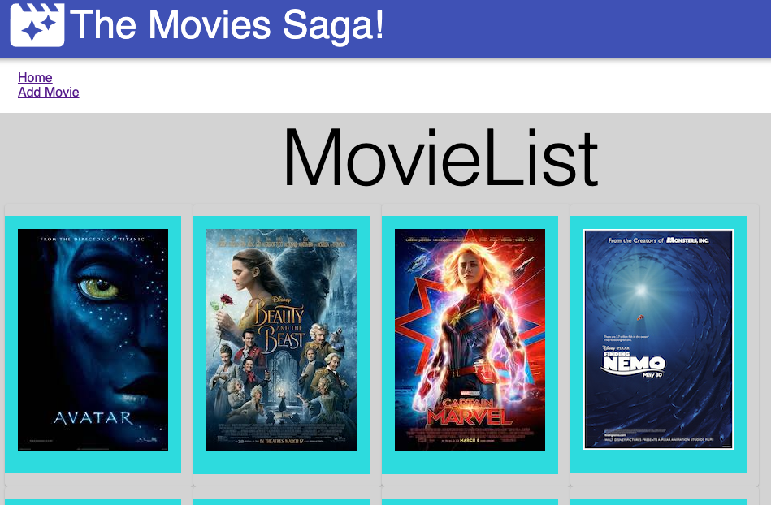
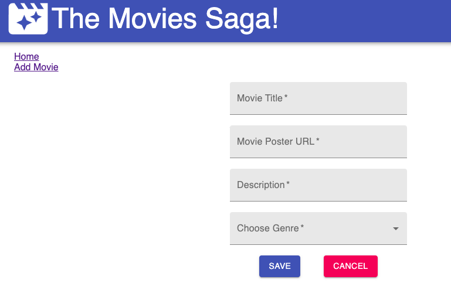
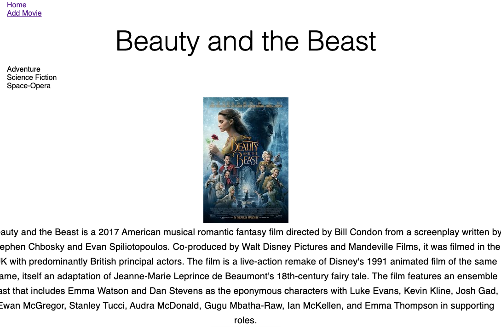

# Weekend Movie Sagas

## Description

Duration: 14 hours

Our client has movie and genre database currently set up but wants to add some features to it.
Here's what that home page looks like:

To start they would like an add movie feature to allow users to add more movies to the list. The inputs that should be included are: title, poster url, description and a dropdown menu for genres.
Here's an example of what the 'Add Movie' page might look like:

In addition the client would like the ability for users to view all of the information on the click of a movie. That click should bring the user to a page that would show all genres the movie falls in, the description, poster and title.

Updated wireframe photos:

## Installation

1. Clone this repository and open in VS Code (or another code editor)
1. Run an npm install to retrieve all dependencies
1. Create the database in Postico (or another database)
   1. Name the database saga_movies_weekend (or you'll need to change it in the modules/pool.js)
   1. Create tables and enter the values provided in the database.sql file
1. Open two terminal windows:
   1. Run 'npm run server' in one
   1. Run 'npm run client' in the other

## Usage

1. The user starts out on the home page, with all the movies, showing Title and Movie poster
1. The user may click on the add movie button which would bring them to the form to enter in the information on whichever movie they would like to add. If the user changes their mind they may click the cancel button and no data is saved.
1. The user may then click on a specific movie which would bring them to a detailed page. The detail page shows the Title, poster, genres, and description of the movie.

## Built With:

- Node.js
- Express.js
- PostgreSQL
- SQL
- Postico
- React.js
- Redux (Reducers & Sagas)
- CSS
- JavaScript, JSX
- Material UI

## Acknowledgement

I'd like to thank my family for all their support and encouragement throughout my endeavors with Prime. I'd also like to thank the staff at Prime for all their help, especially Mary Mosman who has taught me all I know!
